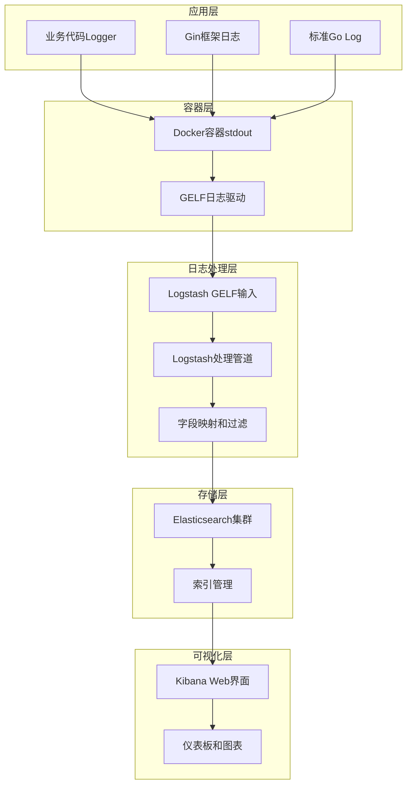

# Wonder项目日志系统完整指南

## 📖 目录

- [概述](#概述)
- [架构原理](#架构原理)
- [技术栈](#技术栈)
- [日志流程](#日志流程)
- [配置说明](#配置说明)
- [使用方式](#使用方式)
- [搜索语法](#搜索语法)
- [监控和告警](#监控和告警)
- [故障排查](#故障排查)
- [最佳实践](#最佳实践)

## 🎯 概述

Wonder项目采用现代化的集中式日志管理系统，基于ELK Stack构建，提供从日志生成、收集、处理到可视化的完整解决方案。系统支持结构化日志记录、实时搜索分析和智能告警，为开发和运维提供强大的可观测性支持。

### 核心特性

- **结构化日志**: 基于JSON格式的结构化日志记录
- **实时收集**: 近实时的日志收集和索引
- **强大搜索**: 支持复杂查询语法和全文搜索
- **可视化分析**: 丰富的图表和仪表板
- **分布式追踪**: TraceID支持的请求链路追踪
- **告警通知**: 基于日志模式的智能告警

## 🏗️ 架构原理

### 整体架构图



### 数据流原理

1. **日志生成**: 应用代码使用结构化Logger输出JSON格式日志
2. **容器收集**: Docker GELF驱动实时收集容器标准输出
3. **传输处理**: Logstash接收GELF数据并进行字段映射和清洗
4. **索引存储**: Elasticsearch按日期创建索引并存储文档
5. **查询展示**: Kibana提供Web界面进行搜索和可视化

## 🛠️ 技术栈

### 核心组件

| 组件 | 版本 | 作用 | 端口 |
|------|------|------|------|
| **Elasticsearch** | 8.14.1 | 日志存储和搜索引擎 | 9200 |
| **Logstash** | 8.14.1 | 日志收集和处理 | 5044, 12201 |
| **Kibana** | 8.14.1 | 日志可视化和分析 | 5601 |
| **Docker GELF** | - | 容器日志驱动 | UDP 12201 |

### 应用层技术

- **日志库**: 自研pkg/logger (基于logrus)
- **Web框架**: Gin (内置访问日志)
- **追踪系统**: 自实现TraceID中间件
- **配置管理**: 环境变量和配置文件

## 🔄 日志流程

### 1. 应用日志生成

#### 结构化业务日志
```go
// 使用Wonder自研Logger
logger := logger.Get().WithLayer("application").WithComponent("auth_service")
logger.Info(ctx, "processing login request", "email", email, "user_id", userID)

// 输出格式
{
    "component": "auth_service",
    "layer": "application",
    "level": "info",
    "message": "processing login request",
    "timestamp": "2025-09-27T10:21:38.172Z",
    "trace_id": "38b24ecc-a0bd-4901-9a5f-5b60c96a3060",
    "email": "user@example.com",
    "user_id": "1971881098828840960"
}
```

#### Gin框架访问日志
```bash
[GIN] 2025/09/27 - 10:35:35 | 200 | 2.568625ms | 172.18.0.8 | GET "/metrics"
```

#### 标准Go日志
```bash
2025/09/27 10:21:38 Starting wonder server on 0.0.0.0:8080 (environment: development)
```

### 2. Docker容器配置

```yaml
# docker-compose.yaml
services:
  wonder:
    # ... 其他配置
    logging:
      driver: gelf
      options:
        gelf-address: "udp://127.0.0.1:12201"
```

**GELF格式包装**:
```json
{
  "version": "1.1",
  "host": "docker-desktop",
  "short_message": "原始日志内容",
  "timestamp": 1727432515.033,
  "level": 6,
  "container_id": "e101130a59c8166a...",
  "container_name": "wonder-app",
  "image_name": "wonder-wonder",
  "command": "./server"
}
```

### 3. Logstash处理管道

```ruby
# monitoring/logstash/pipeline/logstash.conf
input {
  gelf {
    host => "0.0.0.0"
    port => 12201
    add_field => { "service" => "wonder" }
  }
}

filter {
  mutate {
    rename => { "short_message" => "message" }
    remove_field => ["@version", "_score"]
  }
}

output {
  elasticsearch {
    hosts => ["http://elasticsearch:9200"]
    index => "wonder-logs-%{+YYYY.MM.dd}"
  }
}
```

### 4. Elasticsearch存储

**索引命名**: `wonder-logs-YYYY.MM.dd`
**文档结构**:
```json
{
  "_index": "wonder-logs-2025.09.27",
  "_source": {
    "service": "wonder",
    "message": "原始日志内容",
    "container_name": "wonder-app",
    "image_name": "wonder-wonder",
    "host": "docker-desktop",
    "@timestamp": "2025-09-27T10:35:35.033Z",
    "level": 6,
    "container_id": "e101130a59c8166a...",
    "command": "./server"
  }
}
```

## ⚙️ 配置说明

### 应用日志配置

```yaml
# 环境变量配置
WONDER_LOG_LEVEL: info        # 日志级别: debug, info, warn, error
WONDER_LOG_FORMAT: json       # 日志格式: json, text
WONDER_LOG_OUTPUT: stdout     # 输出目标: stdout, file, both
WONDER_LOG_ENABLE_FILE: false # 是否启用文件日志
```

### Logger组件配置

```go
// 创建Logger实例
logger := logger.NewLoggerWithConfig(logger.LogConfig{
    Level:      "info",
    Format:     "json",
    Output:     "stdout",
    FilePath:   "/app/logs/wonder.log",
    EnableFile: false,
})

// 添加上下文信息
appLogger := logger.WithLayer("application").WithComponent("auth_service")
```

### Docker日志驱动配置

```yaml
logging:
  driver: gelf
  options:
    gelf-address: "udp://127.0.0.1:12201"
    gelf-compression-type: "none"
    gelf-compression-level: "1"
```

## 📝 使用方式

### 1. 业务代码中记录日志

#### 基本用法
```go
package service

import (
    "context"
    "github.com/cctw-zed/wonder/pkg/logger"
)

type authService struct {
    log logger.Logger
}

func NewAuthService() AuthService {
    return &authService{
        log: logger.Get().WithLayer("application").WithComponent("auth_service"),
    }
}

func (s *authService) Login(ctx context.Context, email, password string) error {
    // 记录信息日志
    s.log.Info(ctx, "processing login request", "email", email)

    // 处理业务逻辑...

    if err != nil {
        // 记录警告日志
        s.log.Warn(ctx, "login failed", "error", err, "email", email)
        return err
    }

    // 记录成功日志
    s.log.Info(ctx, "login successful", "user_id", user.ID, "email", email)
    return nil
}
```

#### 高级用法
```go
// 添加错误上下文
errorLogger := s.log.WithError(err)
errorLogger.Error(ctx, "database connection failed")

// 条件日志记录
if s.log.DebugEnabled() {
    s.log.Debug(ctx, "detailed debug info", "request_body", string(body))
}

// 链式调用
s.log.With("module", "payment").
      With("transaction_id", txID).
      Info(ctx, "payment processed")
```

### 2. TraceID追踪

#### 中间件自动注入
```go
// 请求自动携带TraceID
func (h *AuthHandler) Login(c *gin.Context) {
    traceID := middleware.GetTraceIDFromContext(c.Request.Context())

    // TraceID会自动添加到日志中
    h.log.Info(c.Request.Context(), "handling login request")
}
```

#### 手动添加TraceID
```go
// 在context中添加TraceID
ctx = context.WithValue(ctx, "trace_id", "custom-trace-id")
logger.Info(ctx, "custom trace logging")
```

### 3. 访问Kibana界面

#### 登录访问
- **地址**: http://localhost:5601
- **索引模式**: `wonder-logs-*`
- **时间字段**: `@timestamp`

#### 基本操作
1. **Discover页面**: 实时查看和搜索日志
2. **Dashboard**: 创建可视化仪表板
3. **Index Management**: 管理日志索引

## 🔍 搜索语法

### 基础搜索

#### 文本搜索
```bash
# 简单文本匹配
error
login failed
authentication

# 字段搜索
message:"login failed"
level:"error"
component:"auth_service"
```

#### 布尔操作
```bash
# AND操作
component:"auth_service" AND level:"error"

# OR操作
level:"error" OR level:"warn"

# NOT操作
NOT message:"[GIN]"

# 组合操作
(level:"error" OR level:"warn") AND component:"auth_service"
```

### 高级搜索

#### 通配符和正则
```bash
# 通配符
user*
auth_*_service

# 正则表达式
message:/login.*failed/
message:/user_\d+/
```

#### 范围搜索
```bash
# 时间范围
@timestamp:[now-1h TO now]
@timestamp:[2025-09-27T10:00:00 TO 2025-09-27T11:00:00]

# 数字范围
level:[1 TO 5]
```

### Wonder项目专用搜索

#### 业务日志过滤
```bash
# 排除访问日志，只看业务日志
NOT message:"[GIN]" AND NOT message:"[GIN-debug]"

# 按业务层级搜索
message:"\"layer\":\"application\""
message:"\"layer\":\"infrastructure\""

# 按组件搜索
message:"\"component\":\"auth_service\""
message:"\"component\":\"user_service\""
```

#### TraceID追踪
```bash
# 完整请求链路追踪
message:"38b24ecc-a0bd-4901-9a5f-5b60c96a3060"

# TraceID + 错误
message:"38b24ecc-a0bd-4901-9a5f-5b60c96a3060" AND level:"error"
```

#### 错误和异常分析
```bash
# 所有错误日志
level:"error" OR message:"error" OR message:"failed"

# 认证相关错误
(message:"auth" OR message:"login") AND level:"error"

# 数据库相关问题
message:"database" AND (level:"error" OR message:"timeout")
```

## 📊 监控和告警

### 常用监控查询

#### 系统健康监控
```bash
# 错误率趋势
level:"error" AND @timestamp:[now-1h TO now]

# 认证失败监控
message:"login" AND message:"failed" AND @timestamp:[now-24h TO now]

# 性能问题检测
message:"timeout" OR message:"slow"
```

#### 业务指标监控
```bash
# 用户注册监控
message:"user" AND message:"registered"

# API调用统计
message:"[GIN]" AND NOT message:"GET /metrics"

# 数据库操作监控
message:"database" AND (message:"created" OR message:"updated" OR message:"deleted")
```

### 告警配置

#### Kibana Watcher告警
```json
{
  "trigger": {
    "schedule": {
      "interval": "1m"
    }
  },
  "input": {
    "search": {
      "request": {
        "search_type": "query_then_fetch",
        "indices": ["wonder-logs-*"],
        "body": {
          "query": {
            "bool": {
              "must": [
                {"match": {"level": "error"}},
                {"range": {"@timestamp": {"gte": "now-5m"}}}
              ]
            }
          }
        }
      }
    }
  },
  "condition": {
    "compare": {
      "ctx.payload.hits.total": {
        "gt": 10
      }
    }
  }
}
```

## 🛠️ 故障排查

### 常见问题及解决方案

#### 1. 日志未出现在Kibana
**症状**: Kibana中看不到新日志
**排查步骤**:
```bash
# 检查容器状态
docker-compose ps

# 检查Logstash日志
docker logs wonder-logstash --tail 50

# 检查Elasticsearch健康状态
curl http://localhost:9200/_cluster/health

# 检查索引是否创建
curl http://localhost:9200/_cat/indices?v
```

#### 2. 日志延迟严重
**症状**: 日志出现延迟超过30秒
**排查步骤**:
```bash
# 检查Logstash处理性能
docker stats wonder-logstash

# 检查Elasticsearch写入性能
curl http://localhost:9200/_stats

# 调整Logstash批处理配置
```

#### 3. 搜索性能差
**症状**: Kibana搜索响应慢
**优化措施**:
- 缩小时间范围
- 使用具体字段搜索而非全文搜索
- 定期清理旧索引
- 优化Elasticsearch内存配置

### 调试技巧

#### 查看原始日志
```bash
# 查看应用容器日志
docker logs wonder-app --tail 100

# 查看Logstash处理日志
docker logs wonder-logstash --tail 50

# 直接查询Elasticsearch
curl -X GET "http://localhost:9200/wonder-logs-*/_search?size=5&sort=@timestamp:desc"
```

#### 验证日志格式
```bash
# 检查JSON格式是否正确
docker logs wonder-app --tail 10 | jq .

# 验证GELF格式
tcpdump -i any -A port 12201
```

## 📋 最佳实践

### 日志记录最佳实践

#### 1. 结构化日志
```go
// ✅ 好的做法 - 结构化字段
log.Info(ctx, "user login successful",
    "user_id", userID,
    "email", email,
    "ip_address", clientIP)

// ❌ 避免 - 非结构化字符串
log.Info(ctx, fmt.Sprintf("User %s (ID: %d) logged in from %s", email, userID, clientIP))
```

#### 2. 合适的日志级别
```go
// DEBUG: 详细的开发调试信息
log.Debug(ctx, "processing request", "request_body", string(body))

// INFO: 重要的业务事件
log.Info(ctx, "user registered successfully", "user_id", userID)

// WARN: 可恢复的错误或异常情况
log.Warn(ctx, "external service timeout, using cache", "service", "payment")

// ERROR: 需要立即关注的错误
log.Error(ctx, "database connection failed", "error", err)
```

#### 3. TraceID使用
```go
// 始终传递context以获取TraceID
func (s *service) ProcessOrder(ctx context.Context, orderID string) error {
    s.log.Info(ctx, "processing order", "order_id", orderID)

    // 调用其他服务时传递context
    err := s.paymentService.Charge(ctx, amount)
    if err != nil {
        s.log.Error(ctx, "payment failed", "order_id", orderID, "error", err)
        return err
    }

    s.log.Info(ctx, "order processed successfully", "order_id", orderID)
    return nil
}
```

### 搜索和分析最佳实践

#### 1. 高效搜索
```bash
# ✅ 使用字段搜索
component:"auth_service" AND level:"error"

# ❌ 避免全文搜索
"auth_service error"

# ✅ 限制时间范围
@timestamp:[now-1h TO now] AND level:"error"

# ❌ 避免无时间限制的搜索
level:"error"
```

#### 2. 有效的过滤策略
```bash
# 按优先级过滤
# 1. 时间范围（最具选择性）
@timestamp:[now-1h TO now]

# 2. 字段过滤
AND component:"auth_service"

# 3. 内容过滤
AND message:"login"
```

#### 3. 仪表板设计
- **关键指标**: 错误率、响应时间、吞吐量
- **时间维度**: 小时、天、周的趋势图
- **业务维度**: 用户操作、API调用、服务状态

### 性能优化

#### 1. 索引管理
```bash
# 定期清理旧索引
curl -X DELETE "http://localhost:9200/wonder-logs-2025.09.01"

# 设置索引模板
curl -X PUT "http://localhost:9200/_template/wonder-logs" -H 'Content-Type: application/json' -d'
{
  "index_patterns": ["wonder-logs-*"],
  "settings": {
    "number_of_shards": 1,
    "number_of_replicas": 0,
    "index.refresh_interval": "30s"
  }
}'
```

#### 2. 查询优化
- 使用过滤器而非查询进行精确匹配
- 避免使用通配符开头的搜索
- 合理设置搜索结果大小限制
- 使用聚合代替大结果集扫描

#### 3. 资源配置
```yaml
# Elasticsearch配置优化
elasticsearch:
  environment:
    - ES_JAVA_OPTS=-Xms2g -Xmx2g
    - indices.memory.index_buffer_size=20%
    - indices.memory.min_index_buffer_size=96mb
```

## 🔧 扩展功能

### 自定义日志字段解析

如果需要将JSON日志字段解析为独立的Elasticsearch字段，可以增强Logstash配置：

```ruby
filter {
  # 尝试解析JSON格式的message字段
  if [message] =~ /^\{.*\}$/ {
    json {
      source => "message"
      target => "parsed"
    }

    # 提升常用字段到根级别
    if [parsed][component] {
      mutate { add_field => { "component" => "%{[parsed][component]}" } }
    }
    if [parsed][layer] {
      mutate { add_field => { "layer" => "%{[parsed][layer]}" } }
    }
    if [parsed][trace_id] {
      mutate { add_field => { "trace_id" => "%{[parsed][trace_id]}" } }
    }
  }
}
```

### 集成外部系统

#### Slack告警集成
```bash
# 配置Webhook通知
curl -X POST https://hooks.slack.com/services/... \
  -H 'Content-Type: application/json' \
  -d '{"text":"Wonder服务错误告警: 检测到大量错误日志"}'
```

#### Prometheus指标集成
```go
// 从日志中导出Prometheus指标
errorCounter := prometheus.NewCounterVec(
    prometheus.CounterOpts{
        Name: "wonder_log_errors_total",
        Help: "Total number of log errors",
    },
    []string{"component", "level"},
)
```

## 📚 相关资源

- [Elasticsearch官方文档](https://www.elastic.co/guide/en/elasticsearch/reference/current/)
- [Logstash配置指南](https://www.elastic.co/guide/en/logstash/current/)
- [Kibana用户手册](https://www.elastic.co/guide/en/kibana/current/)
- [Docker GELF驱动文档](https://docs.docker.com/config/containers/logging/gelf/)

---

**版本**: v1.0
**最后更新**: 2025-09-27
**维护人员**: Wonder开发团队