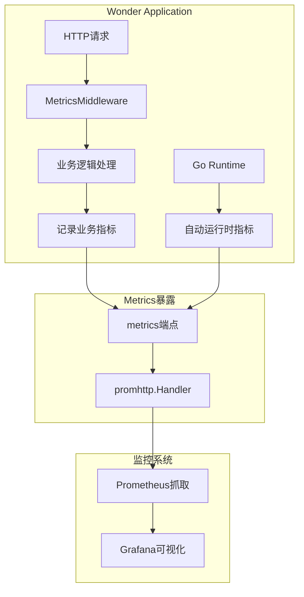
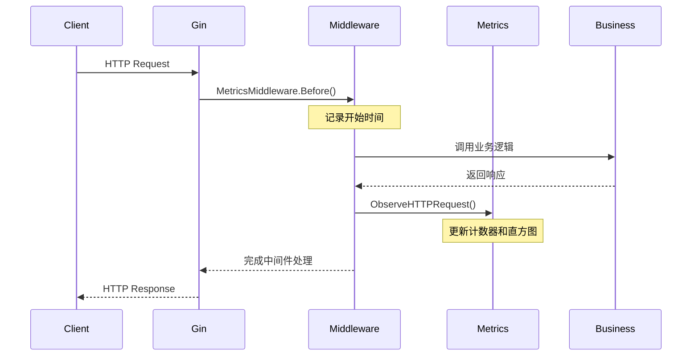

# Wonder项目Metrics指标上报机制详解

## 📖 概述

本文档详细说明Wonder项目中各种metrics指标的上报机制，包括Go运行时自动指标和业务主动上报指标的实现原理、配置方式和使用指南。

## 🏗️ 整体架构

### 指标收集架构图



## 🔄 指标分类详解

### 1. 自动上报指标 (Go运行时)

#### 特性概述
- **零配置要求**: 仅需暴露`/metrics`端点
- **实时更新**: Go运行时自动维护
- **标准规范**: 符合Prometheus命名约定

#### 技术实现

**配置代码** (`internal/server/server.go`):
```go
import "github.com/prometheus/client_golang/prometheus/promhttp"

// 暴露Prometheus metrics端点
router.GET("/metrics", gin.WrapH(promhttp.Handler()))
```

#### 自动暴露的指标清单

| 指标名称 | 类型 | 描述 | 在Grafana中的用途 |
|---------|------|------|------------------|
| `go_goroutines` | Gauge | 当前Goroutine数量 | 并发性能监控 |
| `go_memstats_alloc_bytes` | Gauge | 堆内存分配量 | 内存使用监控 |
| `go_memstats_sys_bytes` | Gauge | 系统内存使用量 | 系统资源监控 |
| `go_gc_duration_seconds_count` | Counter | GC执行次数 | 垃圾收集频率 |
| `go_gc_duration_seconds_sum` | Counter | GC总耗时 | GC性能分析 |
| `go_threads` | Gauge | 操作系统线程数 | 系统资源监控 |
| `process_cpu_seconds_total` | Counter | 进程CPU时间 | CPU使用分析 |
| `process_resident_memory_bytes` | Gauge | 进程驻留内存 | 内存使用监控 |

#### 重要说明

**多服务指标问题**:
- 每个Go应用都会暴露这些运行时指标
- 在Wonder项目中，以下服务都会产生Go运行时指标：
  - Wonder应用本身 (`job="wonder"`)
  - Prometheus服务 (`job="prometheus"`)
  - 其他Go编写的组件

**这就是为什么在Grafana中看到多条相同名称但不同颜色线条的原因**

---

### 2. 业务主动上报指标

#### 特性概述
- **业务相关**: 反映应用特定的业务逻辑
- **丰富标签**: 支持多维度数据分析
- **需要配置**: 定义、注册、记录三步骤

#### 技术实现架构

**第一步: 指标定义** (`internal/infrastructure/metrics/metrics.go`):
```go
package metrics

import (
    "sync"
    "github.com/prometheus/client_golang/prometheus"
)

var (
    registerOnce         sync.Once
    httpRequestsTotal    *prometheus.CounterVec
    httpRequestDuration  *prometheus.HistogramVec
)

func initDefault() {
    // HTTP请求总数计数器
    httpRequestsTotal = prometheus.NewCounterVec(prometheus.CounterOpts{
        Namespace: "wonder",           // 命名空间
        Subsystem: "http",            // 子系统
        Name:      "requests_total",  // 指标名称
        Help:      "Total number of HTTP requests processed, labeled by method, route, and status code.",
    }, []string{"method", "route", "status"}) // 标签维度

    // HTTP请求延迟直方图
    httpRequestDuration = prometheus.NewHistogramVec(prometheus.HistogramOpts{
        Namespace: "wonder",
        Subsystem: "http",
        Name:      "request_duration_seconds",
        Help:      "Histogram of latencies for HTTP requests in seconds.",
        Buckets:   prometheus.DefBuckets, // 默认延迟桶
    }, []string{"method", "route"})

    // 注册指标到Prometheus
    prometheus.MustRegister(httpRequestsTotal, httpRequestDuration)
}

// 确保HTTP指标只注册一次
func EnsureHTTPMetrics() {
    registerOnce.Do(initDefault)
}

// 记录HTTP请求指标
func ObserveHTTPRequest(method, route, status string, durationSeconds float64) {
    EnsureHTTPMetrics()
    httpRequestsTotal.WithLabelValues(method, route, status).Inc()
    httpRequestDuration.WithLabelValues(method, route).Observe(durationSeconds)
}
```

**第二步: 中间件集成** (`internal/middleware/metrics.go`):
```go
package middleware

import (
    "strconv"
    "time"
    "github.com/gin-gonic/gin"
    inframetrics "github.com/cctw-zed/wonder/internal/infrastructure/metrics"
)

// MetricsMiddleware 记录HTTP请求的Prometheus指标
func MetricsMiddleware() gin.HandlerFunc {
    // 确保指标已注册
    inframetrics.EnsureHTTPMetrics()

    return func(c *gin.Context) {
        start := time.Now()

        // 处理HTTP请求
        c.Next()

        // 记录请求指标
        duration := time.Since(start).Seconds()
        route := c.FullPath()
        if route == "" {
            route = "unknown"
        }

        inframetrics.ObserveHTTPRequest(
            c.Request.Method,                    // GET, POST, PUT, DELETE
            route,                              // /api/v1/users, /api/v1/auth/login
            strconv.Itoa(c.Writer.Status()),    // 200, 404, 500
            duration,                           // 响应时间(秒)
        )
    }
}
```

**第三步: 路由配置** (`internal/server/server.go`):
```go
func setupRouter(c *container.Container) *gin.Engine {
    router := gin.New()

    // 注册metrics中间件
    router.Use(middleware.MetricsMiddleware())

    // 暴露metrics端点
    router.GET("/metrics", gin.WrapH(promhttp.Handler()))

    // 其他路由配置...
    return router
}
```

#### 业务指标清单

| 指标名称 | 类型 | 标签 | 描述 |
|---------|------|------|------|
| `wonder_http_requests_total` | Counter | method, route, status | HTTP请求总数 |
| `wonder_http_request_duration_seconds` | Histogram | method, route | HTTP请求延迟分布 |

#### 指标标签说明

**wonder_http_requests_total标签**:
- `method`: HTTP方法 (GET, POST, PUT, DELETE)
- `route`: 路由路径 (/api/v1/users, /api/v1/auth/login)
- `status`: HTTP状态码 (200, 404, 500)

**wonder_http_request_duration_seconds标签**:
- `method`: HTTP方法
- `route`: 路由路径

## 🔧 完整配置流程

### 应用启动时的指标初始化

```go
// 1. 容器初始化时，metrics中间件被注册
func setupRouter(c *container.Container) *gin.Engine {
    router.Use(middleware.MetricsMiddleware())  // 注册metrics中间件
    router.GET("/metrics", gin.WrapH(promhttp.Handler()))  // 暴露指标端点
}

// 2. 第一次HTTP请求时，指标被初始化和注册
func MetricsMiddleware() gin.HandlerFunc {
    inframetrics.EnsureHTTPMetrics()  // 使用sync.Once确保只初始化一次
}
```

### HTTP请求处理时的指标记录



### Prometheus抓取配置

**Prometheus配置** (`monitoring/prometheus/prometheus.yml`):
```yaml
global:
  scrape_interval: 15s
  evaluation_interval: 15s

scrape_configs:
  - job_name: wonder
    static_configs:
      - targets: [wonder:8080]
    metrics_path: /metrics
    scrape_interval: 15s

  - job_name: prometheus
    static_configs:
      - targets: [localhost:9090]
```

## 📊 Grafana中的指标使用

### 查询示例

**HTTP请求速率**:
```promql
# 每秒请求数
rate(wonder_http_requests_total[1m])

# 按路由分组的请求速率
sum(rate(wonder_http_requests_total[1m])) by (route)

# 错误率
rate(wonder_http_requests_total{status=~"4..|5.."}[1m])
```

**响应时间分析**:
```promql
# 平均响应时间
rate(wonder_http_request_duration_seconds_sum[1m]) /
rate(wonder_http_request_duration_seconds_count[1m])

# P95响应时间
histogram_quantile(0.95, rate(wonder_http_request_duration_seconds_bucket[1m]))
```

**Go运行时指标**:
```promql
# Goroutine数量
go_goroutines

# GC频率
rate(go_gc_duration_seconds_count[1m])

# 内存使用
go_memstats_alloc_bytes
```

### 多实例标签处理

**问题**: 多个Go服务会产生相同名称的运行时指标

**解决方案**:
```promql
# 只查询Wonder应用的指标
go_goroutines{job="wonder"}

# 聚合所有实例的指标
sum(go_goroutines)

# 按服务分组
sum(go_goroutines) by (job)
```

## 🎯 最佳实践

### 指标命名规范

1. **命名空间**: 使用应用名称作为前缀 (`wonder_`)
2. **子系统**: 按功能模块分组 (`http_`, `database_`, `cache_`)
3. **单位**: 在名称中包含单位 (`_seconds`, `_bytes`, `_total`)

### 标签设计原则

1. **低基数**: 避免使用用户ID等高基数标签
2. **有意义**: 标签值应该有业务意义
3. **一致性**: 相同含义的标签在不同指标中保持一致

### 性能优化

1. **批量注册**: 使用`sync.Once`确保指标只注册一次
2. **标签缓存**: 对于固定标签组合，可以预先创建
3. **避免创建**: 不要在运行时动态创建新的指标

## 🔍 故障排查

### 常见问题

**1. 指标未出现**:
- 检查中间件是否正确注册
- 验证`/metrics`端点是否可访问
- 确认Prometheus能够抓取到目标

**2. 指标值异常**:
- 检查标签值是否正确
- 验证指标类型是否合适
- 确认计算逻辑是否正确

**3. 性能问题**:
- 检查标签基数是否过高
- 验证指标注册次数
- 确认没有内存泄漏

### 调试命令

```bash
# 检查指标端点
curl http://localhost:8080/metrics | grep wonder

# 验证Prometheus抓取
curl http://localhost:9090/api/v1/targets

# 查询特定指标
curl "http://localhost:9090/api/v1/query?query=wonder_http_requests_total"
```

## 📚 相关资源

- [Prometheus Go Client库文档](https://github.com/prometheus/client_golang)
- [Prometheus指标类型说明](https://prometheus.io/docs/concepts/metric_types/)
- [Grafana查询语法指南](https://grafana.com/docs/grafana/latest/panels/query-a-data-source/use-query-editor/)
- [Go运行时指标详解](https://pkg.go.dev/runtime)

---

**版本**: v1.0
**最后更新**: 2025-09-27
**维护人员**: Wonder开发团队